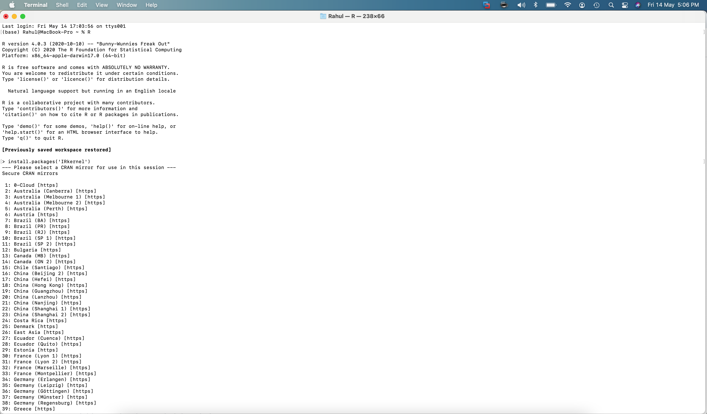
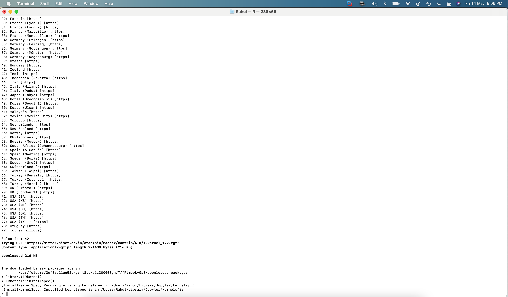
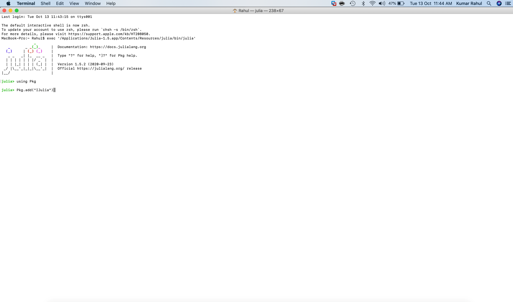

## Welcome to the world of Decisions with Data
This is a repository for data science using Python R & Julia. Few links to the material are updated however the page is still in development and will be updated in due course.

### Hardware and software Requirements 
One needs to have the below configurations for working on the projects using Python, R or Julia:

* Participants should bring their laptop (preferably Windows 7 or higher/ Mac OS installed). 
* Operating System (any of the following): 
> * Mac OS X with [XQuartz](https://www.xquartz.org/)
> * Windows (Version XP or later) is required. 
> * Minimum 16 GB RAM on the system is advisable.

### Machine Learning using Python
One will need to have anaconda framework  for working on data science project using Python. The installations and repositories for using Python software are as below:

#### Installations:
Latest version of the software can be found at: 

> * For Windows, go to this [link](https://docs.anaconda.com/anaconda/install/windows.html) 
> * [Install](https://docs.anaconda.com/anaconda/install/mac-os ) anaconda for MacOS.
> * For Linux, use this link for [installation](https://docs.anaconda.com/anaconda/install/linux) 

More about anaconda can be found [here](https://docs.anaconda.com). Participants are expected to resolve any installation issues of the software prior to the commencement of the session.

#### Repositories
The link to the repositories are here:

* Here is the [repository link](https://github.com/rahul235/ML_using_Python/) for ML using Python.

### Machine Learning using R
One will need R and may need RStudio to work on data science project using R. The installations and repositories for working with R software are as below:

#### Installations
Participants should have latest version of R and R Studio installed on their system. First Install R and then R Studio. Latest version of the software can be found at: 
  > *  R software can be downloaded from this [link](https://cran.r-project.org/). Download the version specific to your operating system.
  > *  RStudio can be downloaded [here](https://www.rstudio.com/products/rstudio/download)
  
RStudio may not be needed if using jupyter notebook. `Anaconda with jupyter notebook can also be used to work with R software.` 

> * Install operating system specific version of [R software](https://cran.r-project.org/)
> * open R console (or open R through Terminal in Mac). Enter the below command:

    > install.packages('IRkernel’) ##install the IR kernel
    > library(IRkernel) ## Invoke the package
    > IRkernel::installspec() ## Make Jupyter Notebook point to the R kernel
    
 The above commands were tested in MacOs Big Sur 11.0.1:
 

Now you can open Jupyter Notebook and you can write your R script by using R kernel. Participants are expected to resolve any installation issues of the software prior to the commencement of the session.

#### Repositories
* R software for statistical analysis is yet another popular langauge for working on data science project. Here is the  [repository link](https://github.com/rahul235/ML_using_R/) for Machine learning using R.
* More about data visualization and programming with R can be found at [this link](https://github.com/rahul235/R_Programming/).

### Machine Learning using Julia
One will need to have anaconda framework  for working on data science project using Julia. The installations and repositories for using Julia software are as below:

#### Installations:

1. Latest version of the anaconda software can be found at: 

> * For Windows, go to this [link](https://docs.anaconda.com/anaconda/install/windows.html) 
> * [Install](https://docs.anaconda.com/anaconda/install/mac-os ) anacondat for MacOS.
> * For Linux, use this link for [installation](https://docs.anaconda.com/anaconda/install/linux) 

More about anaconda can be found at https://docs.anaconda.com. 
Participants are expected to resolve any installation issues of the software prior to the commencement of the session.

2. Download Julia:

* Download the OS specific version from [this link](https://julialang.org/downloads/). Once installation is complete, open Julia command line/prompt. 
* To add julia to Jupyter Notebook, type “using Pkg” on the Julia command prompt. Next, type “Pkg.add(“IJulia”) on the Julia command prompt and let the installation finish.

* You are ready to work with Julia!!! Launch Jupyter Notebook and open the Julia Kernel.

Platform specific issues can be accessed from [here](https://julialang.org/downloads/platform/). Participants are expected to resolve any installation issues of the software prior to the commencement of the session.

#### Repositories
The link to the repositories are here: not updated yet.

You can reach me at rahul235@gmail.com
